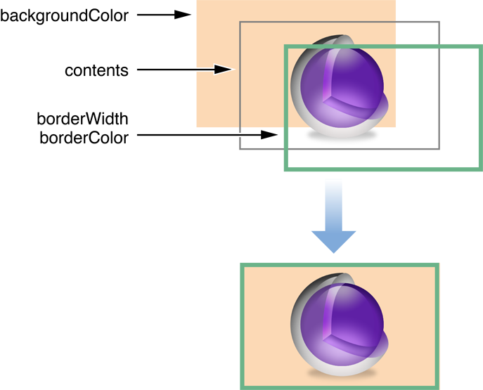

## Core Animation文档阅读笔记
这篇文章并不是用来demo在iOS开发中如何利用[Core Animation](https://developer.apple.com/library/content/documentation/Cocoa/Conceptual/CoreAnimation_guide/Introduction/Introduction.html)框架完成动画的。而是，想要尝试探究Core Animation一些原理和容易被忽略的东西。

### UIView动画

对于iOS编程的初学者来说，在使用动画的时候，使用UIView本身的`block-based animation`就能够满足绝大部分的业务需求了。但是如果有下面三个场景，使用Core Animation提供的动画类来设计完成动画就更加方便、灵活：

- 想要更加细粒度地控制动画参数（比如，动画中视图位移不是直线路径）；
- 想要创建动画组，包含多个同时进行的动画；

另外，对于UIView本身的`block-based animation`而言，其本质也是在相应的CALayers上完成动画。这一点与直接创建CAAnimation的子类动画对象（`CABasicAnimation`, `CAKeyFrameAnimation`），配置动画参数，添加到对应layer上并没有太多实质的区别。所以可以将UIView本身的`block-based animation`看成是一层Wrapper或者是Apple文档中提到的`implicit animation`（隐式动画）。

### CALayer
`UIView`实际上是在`CALayer`之上的一层thin wrapper。至少从Apple的文档看来，性能已经很好了；所以，也更加推荐尽量使用`UIView`及其子类来完成App视图层级的构建。另外，`UIView`本身还支持`Autolayout`，所以就更加值得使用过了。

就`CALayer`本身，它是如果将我们动态的App内容渲染出来的。[文档](https://developer.apple.com/library/content/documentation/Cocoa/Conceptual/CoreAnimation_guide/SettingUpLayerObjects/SettingUpLayerObjects.html#//apple_ref/doc/uid/TP40004514-CH13-SW4)也做了一些说明。简单的讲，也就是如果我们是使用`UIView`，渲染的过程是自动的（也就是我们并没有显式地赋值layer的`contents`属性）；而如果我们需要使用***独立的layer***，那就需要我们显式地给该layer指定内容。当然，需要区别是的这个内容，并不是指layer的背景颜色，边框。下图就能较好说明layer的内容是那个部分。


也就是最终一个layer不管是静态地展示还是在动画过程中。它都是通过将自己的内容和其他附加属性合成为一张bitmap，绘制到屏幕上。

CALayer在开放的API中有两种不同的作用的layer（这里谈论的不是layer的子类有多少）：`model layer`和`presentation layer`。`model layer`中存储了在非动画过程中，我们直接观察到的layer的状态（背景色、opacity等）；而`presentation layer`是对动画过程变化图层的一种近似。也就是说我们在（比如，移动view的过程中）是能够通过`presentation layer`来获取到动画过程中某一时刻的view的位置。

### Implicit Animation Vs. Explicit Animation

在[Core Animation](https://developer.apple.com/library/content/documentation/Cocoa/Conceptual/CoreAnimation_guide/Introduction/Introduction.html)的文档中多次提到这两个术语：implicit animation和explicit animation，但并没有做出专门的解答。

我的理解是，但凡没有显示地（explicitly）创建一个`CAAnimation`的子类动画对象，同时添加到layer上进行的动画而产生的动画效果都可以被叫做隐式动画。对于目前这个部分文档的理解，包括了两种类型：
- UIView本身的`block-based animation`;
- 单独被添加到一个UIView对象上的layer，在改变了一个[可动画属性](https://developer.apple.com/library/content/documentation/Cocoa/Conceptual/CoreAnimation_guide/AnimatableProperties/AnimatableProperties.html#//apple_ref/doc/uid/TP40004514-CH11-SW1)之后产生的动画；
    
关于第二点需要做一些说明。一个独立的layer在被添加到一个已经有了一个默认layer的UIView对象上（该类视图被叫做`layer-backed view`）；如果改变这个独立layer的[可动画属性](https://developer.apple.com/library/content/documentation/Cocoa/Conceptual/CoreAnimation_guide/AnimatableProperties/AnimatableProperties.html#//apple_ref/doc/uid/TP40004514-CH11-SW1)，那么这个属性的改变是自动会被动画的。想要禁止这个动画的出现需要使用`CATransaction`的方法。

```OBJC
[CATransaction begin];
[CATransaction setDisableActions:YES]; //如果去掉，就会看到动画效果
animationLayer.backgroundColor = [UIColor blueColor].CGColor; //独立layer
[CATransaction commit];
```
那这个改变了`backgroundColor`就在**独立layer**产生的动画就是前面提到的`implicit animation`。需要禁用这种动画就需要**显示地**开始一个`CATransaction`，在该事务中禁用掉所有的`actions`。

但是，这样为什么禁用掉了动画？？

所有的`CAAnimation`都遵守`CAAction`这一类的协议。`CAAction`实际定义了更广义的`CALayer`的行为。一个layer上的动画，都是可以看成是一种具体实现`CAAction`的协议方法的行为。所以，当你禁用layer上的所有actions之后，当然动画效果也不会出现了。

对于前面提到的`view-backed layer`（比如所有的默认的UIView类及其子类创建的对象），它们的默认layer在修改[可动画属性](https://developer.apple.com/library/content/documentation/Cocoa/Conceptual/CoreAnimation_guide/AnimatableProperties/AnimatableProperties.html#//apple_ref/doc/uid/TP40004514-CH11-SW1)时，都是没有动画的。具体实现和禁用**独立layer**的动画实现方式可能类似。然后在UIView的动画block中，再开启所有的actions。

### CATransaction

前面我们看到了`CATransaction`被用来禁用动画。`CATransaction`的实际用途还有很多。在Apple文档中提到：***当你改变layer的属性时，如果没有显示开启一个事务，那么`Core Animation`会自动地开启一个事务。***

`CATransaction`的用途比较广泛，比如：
- 在一个事务中，可以修改layer的多个属性，做统一的一次事务提交；
- 事务可以嵌套`nested transactions`，它可以保证在不同的动画组中有不同的动画参数，互不隐藏。
    ```OBJC
    [CATransaction begin]; // Outer transaction
    // Change the animation duration to two seconds
    [CATransaction setValue:[NSNumber numberWithFloat:2.0f]
    		     forKey:kCATransactionAnimationDuration];
    // Move the layer to a new position
    theLayer.position = CGPointMake(0.0,0.0);
    [CATransaction begin]; // Inner transaction
    // Change the animation duration to five seconds
    [CATransaction setValue:[NSNumber numberWithFloat:5.0f]
    		forKey:kCATransactionAnimationDuration];
    // Change the zPosition and opacity
    theLayer.zPosition=200.0;
    theLayer.opacity=0.0;
    [CATransaction commit]; // Inner transaction
    [CATransaction commit]; // Outer transaction
    ```
- 可以利用事务修改隐式动画的参数。
    ```OBJC
    [CATransaction begin];
    [CATransaction setValue:[NSNumber numberWithFloat:10.0f]
    forKey:kCATransactionAnimationDuration];
    // Perform the animations
    [CATransaction commit];
    ```

### 参考文献
- [Core Animation Programming Guide](https://developer.apple.com/library/content/documentation/Cocoa/Conceptual/CoreAnimation_guide/Introduction/Introduction.html)
- [Obj.io Issue: Core Animation](https://www.objc.io/issues/12-animations/)
- [自己的Demo](https://github.com/Alex1989Wang/Demos/tree/master/DemoProjects/LayerTest)
