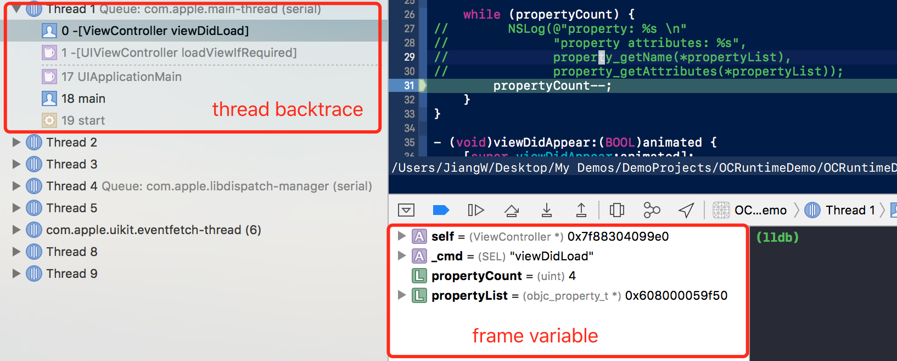
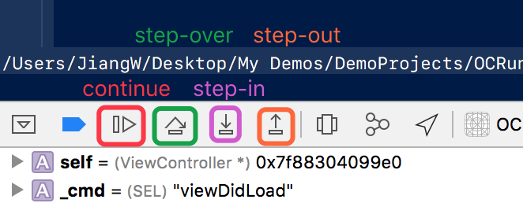

# LLDB 常用命令补充

在[上篇](about-lldb-what-else-do-you-know.md)中，简单介绍了`lldb`命令的基本使用和调试流程。在每个调试流程中有一系列的命令，在这篇中主要介绍常用的命令。

当然，对于`lldb`而言，其有十分详尽的`help`查阅功能。

## 管理`breakpoint`

`breakpoint`是调试程序首要的手段。它提供了能够暂停程序执行来与程序交互的手段。

`lldb`提供了许多`[subcommand]`对于`breakpoint`的管理特性：

- `set`用于设置断点
- `enable`和`disable`用于对断点的开启和禁用
- `clear`和`delete`用于清除断点
- `list`用于查看设置的断点的相关信息
- `modify`用于修改某个（多个）断点的相关信息
- `command`用于添加、删除或者修改某个（多个）断点在到达时需要执行的`lldb`相关命令
- `read`和`write`可以用文件中读入和写入断点
- ...

需要解释的一点是关于断点编号。当使用`breakpoint list`命令的时候，会看到类似下面的输出：

```cmd
(lldb) breakpoint list

Current breakpoints:
1: name = 'sayHello', locations = 1
    1.1: where = main`main.sayHello () -> () + 15 at main.swift:2, address =
    main[0x00000001000011cf], unresolved, hit count = 0
2: file = 'main.swift', line = 4, exact_match = 0, locations = 1
    2.1: where = main`main + 70 at main.swift:7, address = main[0x00000001000011a6],
    unresolved, hit count = 0
```
在使用命令设置一个断点时候，创建的是逻辑断点（`logical breakpoint`）。一个逻辑断点会分配一个数字的序列号；一个逻辑断点可能对应不同的在源文件中的位置（比如，当用方法名来设置断点时，不同的文件中的该同名方法都会被打上断点，所以出现多处位置）。

所以上例中，`1:`和`2:`对应的是不同的逻辑断点，它们`locations`参数都是1，也就是只出现一处。

如果有新的源文件加入，又符合该逻辑断点的设置的条件。该逻辑断点会出现新的断点位置。

在命令设置断点时，找不到具体位置的断点被称为`pending breakpoint`。

### 编辑断点属性

使用`breakpoint modify`修改某一个断点或者是断点位置的属性。该命令的参数（`argument`）为断点ID或者是特点断点位ID。比较实用的属性修改有：

- `--one-shot`设置断点为执行一次就被自动移除
- `--condition`满足该条件时，该断点才会断下程序运行
- `--ignore-count`在该断点第一次起作用断下程序的执行之前应该被忽略几次

例如：

```cmd
(lldb) breakpoint modify --one-shot 1
```

将`breakpoint ID`为`1`的断点设置为一次执行就自动移除掉。

### 添加断点处执行的`lldb`指令

使用`breakpoint command add`命令添加断点到达时需要执行的`lldb`指令。该命令的参数与编辑断点属性参数一直，为`breakpoint ID`或者`location ID`。

例如：

```cmd
(lldb) breakpoint command add 1.1
Enter your debugger command(s). Type 'DONE' to end.
> thread backtrace
> frame variable 
> DONE
```

在`location ID`为`1.1`的断点位到达时，执行输出调用栈和当前栈帧的所有变量信息。该功能获取的信息实际上就是`XCode`的`debug console`上的一些输出信息。

<div align='center'>

<br />
</div>

## 控制程序执行流程

关于这个部分命令没有什么可以补充的。在[上篇](about-lldb-what-else-do-you-know.md)中，就已经做了比较详细的介绍。

在`XCode`的调试面板中，也就这几个指令相对应的控件按钮。

<div align='center'>

<br />
</div>


## 查看调用栈信息

关于调用栈，[文档](https://developer.apple.com/library/content/documentation/General/Conceptual/lldb-guide/chapters/C5-Examining-The-Call-Stack.html#//apple_ref/doc/uid/TP40016717-CH10-SW1)有一个粗略的解释：

> While a program is running, it stores information about what it’s doing in a data structure known as a call stack. Each time a method is called, the program pushes a new stack frame on top of the call stack, which contains the following: the arguments passed to the method, if any, the local variables of the method, if any, and the address to return to after the method call finishes.

通过`thread backtrace`命令可以输出当前调用栈信息，也就是程序是如何到达当前栈帧的。

关于栈帧的调试命令`frame`的`[subcommand]`常用的大概有三个：

- `frame select`选择需要查看的栈帧
- `frame info`输出该栈帧的信息
- `frame variable`输出栈帧上所有变量的信息

使用`help frame [subcommand]`查看更多关于调用栈调试的命令。

## 参考资料

- [LLDB Quick Start Guide](https://developer.apple.com/library/content/documentation/IDEs/Conceptual/gdb_to_lldb_transition_guide/document/Introduction.html)
- [LLDB Debugging Guide](https://developer.apple.com/library/content/documentation/General/Conceptual/lldb-guide/chapters/Introduction.html)
- [Advanced Debugging with LLDB - WWDC](https://developer.apple.com/videos/play/wwdc2013/413/)
- [The LLDB Debugger](https://lldb.llvm.org/)
