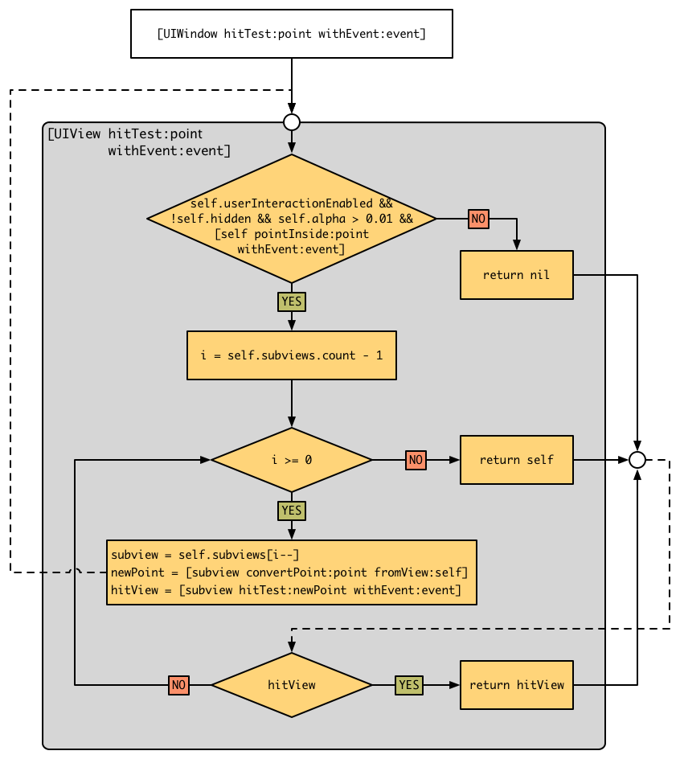

# Hit Test和响应者链条

iOS应用定义了多种[事件](https://developer.apple.com/library/content/documentation/EventHandling/Conceptual/EventHandlingiPhoneOS/)，简单的分类有三种：
- MultiTouch Events 多点触摸事件
- Motion Events 设备加速器、陀螺仪检测到的运动事件
- Remote Control Events 比如蓝牙耳机等对设备的控制

这篇文章主要基于触摸事件来说明Hit Test和响应者链条。iOS在处理用户触摸事件的时候是通过响应者链条来***向上***回溯找到一个`UIResponder`及其子类的对象，将事件交由它来处理的。

那这样一个过程实际上是两个步骤，首先用户在点击屏幕区域的时候，如何来判断这个事件应该首先由谁来处理呢，也就是事件的`first responder`是谁呢？

如果这个`first responder`不能够处理这个事件，那么事件将交给`first responder`的`next responder`来处理，那又该遵循什么样的规则来部署这个`next responder`，继而获得由`first responder`至最后一个响应者的链条（`responder chain`）？

## 如何获取`first responder`

获取相应一个触摸事件的`first responder`就是对应用的`view hierachy`做`hit test`的一个过程，首先从`window`开始递归地逆序遍历自己的`subViews`。如果被触摸的区域在某个`subView`内部，再次以同样的方式进行遍历查找。

直到找到一个可能处理该事件的`hit-test view`。这里的可能其实指的是该view的`userInteractionEnabled`属性为`YES`；其`hidden`属性为`NO`；其`alpha`值大于`0.01`。这些都可以从Apple的[API说明](https://developer.apple.com/reference/uikit/uiview/1622469-hittest?language=objc)中获得。

使用到的方法，就主要有两个：

```objc
- (UIView *)hitTest:(CGPoint)point withEvent:(UIEvent *)event;
- (BOOL)pointInside:(CGPoint)point withEvent:(UIEvent *)event;
```
[文章](http://smnh.me/hit-testing-in-ios/)的作者对于`Hit Test`的原理做了详细的解读，同时对```hitTest:withEvent:```方法的可能实现也做了剖析。

其中原理图如下：
<div align='center'>

<br />
</div>

从图中可以看出，在`window`进行`Hit Test`时，会首先判断自己是不是满足基本条件：
- `userInteractionEnabled`
- `hidden`
- `alpha > 0.01`
- 触摸的点是不在在自己的范围内

如果不满足任何一条，则自己不是`hit-test view`。

如果满足，则逆序遍历自己的所有`subViews`。（为什么要逆序：因为后添加的`subView`在最上层的几率大嘛）。对每一个自己的`subView`进行同样的`Hit Test`，如果能够找到一个符合条件的`subView`，那么它就是`hit-test view`。如果没有，就返回自己。

示例代码如下：
```objc
- (UIView *)hitTest:(CGPoint)point withEvent:(UIEvent *)event {
	if (!self.isUserInteractionEnabled || self.isHidden || self.alpha <= 0.01) {
		return nil;
	}

	if ([self pointInside:point withEvent:event]) {
		for (UIView *subview in [self.subviews reverseObjectEnumerator]) {
			CGPoint convertedPoint = [subview convertPoint:point fromView:self];
			UIView *hitTestView = [subview hitTest:convertedPoint withEvent:event];

			if (hitTestView) {
				return hitTestView;
			}
		}
		return self;
	}
	return nil;
}

```

了解`Hit Test`的机制在应用实际开发过程中有几个常用的地方，在[这篇文章中有详细的说明](http://smnh.me/hit-testing-in-ios/)。

## 响应者链条

当在阅读文档时候，[官方文档]()会告诉你响应者链条是一个`dynamic`的链条，一个App不存在`a single responder chain`。这其实是完全可以理解的。因为`first responder`的不同，由这个`first responder`出发到其`next responder`以及`next responder`的`next responder`直至`App Delegate`（如果AppDelegate为UIResponder的子类的话)串联起来的链条，可以是不一样的。只有当`first responder`确定之后，那么整个链条就能被确定下来。

上面我们讲到了`first responder`的确定，那么整个链条是如何被确定的呢？

规则有下面几条：
- 如果一个`responder`的对象的`next responder`方法被重载了，那么该响应者的下一个响应者就是该被重载的方法返回的对象。
- 如果该`responder`是`UIView`类及子类的对象的话。在该view不是一个`view controller`的`root view`的情况下，`next responder`对象为该view的`superView`;反之，为持有该view的`view controller`对象（也就是该`controller`的`self.view`为该view）。
- 如果该`responder`是`UIViewController`类及子类的对象的话。在该Controller不是某个`window`的根控制器的情况下，那么`next responder`是它的父控制器；反之，为该`window`对象。
- 如果该`responder`是`UIWindow`对象，那么其`next responder`是application对象。
- 如果该`responder`是`UIApplication`对象，那么其`next responder`是其代理对象（如果该代理对象是`UIResponder`的子类的话）。

这套逻辑就是用来确定一个`responder`对象的`next responder`从而确定整个响应者链条。下图是对该逻辑的展现。

<div align='center'>

<br />
</div>

## 事件处理流程

在确定了一个触摸事件的`first responder`之后，事件将尝试交由该响应者处理。如何响应者处理不了，事件就会从该响应者开始`reponder chain`中的下一个响应者传递。如果到了最后一个响应者都不能够处理该事件，那么该事件将被应用丢弃掉。

## 参考资料

- [Event Handling for iOS](https://developer.apple.com/library/content/documentation/EventHandling/Conceptual/EventHandlingiPhoneOS/HandlngEventsUsingtheResponderChain.html)
- [Hit Testing in iOS](http://smnh.me/hit-testing-in-ios/)
- [stackoverflow's question on this matter](https://stackoverflow.com/questions/4961386/event-handling-for-ios-how-hittestwithevent-and-pointinsidewithevent-are-r)
