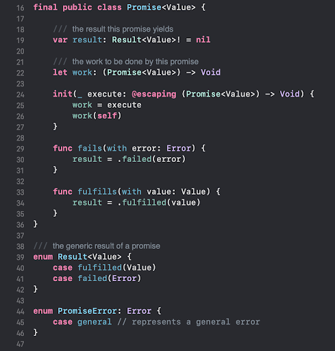
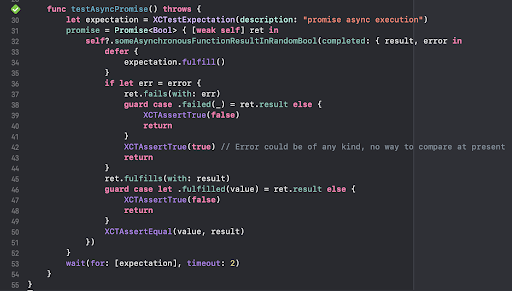
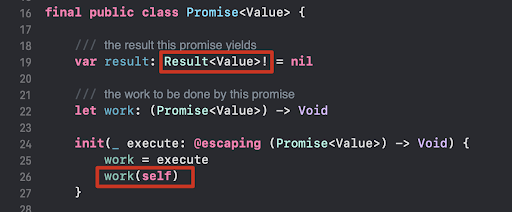
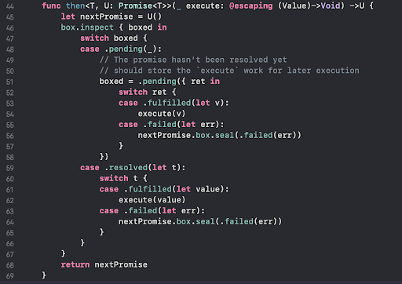
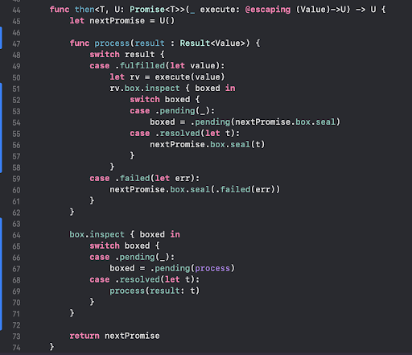

# Make Your Own Promises
The popular open source PromiseKit has an elegant design and it’s easy to get your hands on. There is of course no need to reinvent the wheel. But, in order to know the inner workings of the PromiseKit, we’d better make a PromiseKit of our own. 

So, in the document, we are going to reason through how the PromiseKit comes into being. However, I have never talked to this framework’s author and don’t know exactly what he thought when he coded this framework. 

But, let's see how we can build it. Or how we can mock it, to be more correct. 

See the example project: https://github.com/Alex1989Wang/MakeYourOwnPromise

## What Problems Does It Solve?
Before we go any further, we might want to pause here and think about this important question: what problems does this framework intend to solve? This is the very context from which the PromiseKit was born. 

Take a look at this code snippet: 

```swift
        APIClient.shared.getUserInfo { userInfo in
            APIClient.shared.downloadUserAvatar(userInfo) { avatar in
                avatar.downSizeTo(CGSize(width: 100, height: 100)) { [weak self] thumbnail in
                    self?.imageView.image = thumbnail
                }
            }
        }
```

It makes an asynchronous call to get the user information, then uses that piece of information to get the user’s avatar. At last, it downsizes the avatar to a thumbnail and shows it on the screen. 

The code is clear in its intent, but the style with a closure nested in another is not elegant enough. Imagine we could have a way like this: 

```swift
firstly {
    APIClient.shared.getUserInfo()
} then { userInfo in
    APIClient.shared.downloadUserAvatar(userInfo)
} then { avatar in
    avatar.downSizeTo(CGSize(width: 100, height: 100))
} done { [weak self] thumnail in
    self?.imageView.image = thumnail
}
```

It reads like a fluent sentence. No one could deny the code has clearer intent and is easier to maintain. 

## Make Your Own Promises
Now that we know the context and what we are aiming for, let’s make our own promises. 

### Everything Starts With A Closure
Let’s make our `firstly` function first. 

Well, the `firstly` function should be able to execute a piece of work submitted to it. That’s easy, we just take a closure as a function parameter. 

```swift
public func firstly(_ execute: () -> Void) {
    execute()
}
```

Simple enough, right? 

We can use a TDD pattern when we make our PromiseKit. 

```swift
extension XCTestCase {
    func alwaysTrue() {
        XCTAssertTrue(true)
    }
}

class PromiseFeaturesTests: XCTestCase {
    func testFistlyFunction() throws {
        firstly {
            alwaysTrue()
        }
    }
}
```

Ok, the `firstly` function works. But it doesn’t do much. It takes a closure (a piece of work) to be executed synchronously and it doesn’t return anything to be consumed by the `then` function. And the most important thing of all, how can we execute an asynchronous function and get its result back and pass it to the `then` function? After all, being able to handle asynchronous calls gracefully is what we are aiming for. 

You can checkout this commit from the example project: 9d0d558fb1b6e67fd2d63ad4ff04c62b627add69

### Promise Comes to The Rescue
It makes sense that we need a way to encapsulate our function call and be able to get the call result back so we can pass it to the next step. In this way, we can chain the asynchronous calls all together. 

We need a data structure to do that. We call it `Promise`. So that we can wrap our asynchronous call in the promise and say we will fulfill the promise in the future, which means whoever gets that promise will get the result in the future. The promise should be able to handle data results of all types, so it should be a generic type. 



So, the promise, as mentioned above, should have a property to store the result. This result is either fulfilled by whoever creates the promise and filled with the result value; Or, it should be failed and filled with the error. 

We provide two APIs to either fulfill the promise or fail it. And the promise is initialized with an asynchronous job. Now, let’s test this promise. 



This test means a promise is able to wrap an asynchronous call in it and retain the result in a correct manner. 

Here we have a dummy function which asynchronously returns a random bool and error pair. When there is an error, we presume the function call fails, and we call the promise’s `fails(with error)` API. Otherwise, we decide the function call returns a valid value, in this case, a bool and we call the promise’s `fulfills(with value:)` API to correctly store the value yielded. We then assert what stored in the result is correct. 

So, now we have a simple data structure that can wrap in an asynchronous call and retain the call’s result. 

But, is this design good enough? Probably not. 



1. The result of the promise is implicitly unwrapped. If we try to get this property without first fulfilling or failing this promise, there is going to be a force-unwrap crash. 

2. The init function is a bit strange. It passes in the newly initialized self into the work closure, so that later on when the work is done, self can be either fulfilled or failed by calling its APIs. 

3. What about the chaining we saw before? How can the `firstly` function work with this Promise class and chain different asynchronous calls altogether? 

#### Another Layer Of Encapsulation

There is not a problem in computer science that can not be solved by another layer of abstraction. 

##### Problem 1: remove the force-unwrap
You might wonder, why don’t we just use a normal optional. Like `var result: Result<Value>? = nil`, so that we don’t run into the force-unwrap problem. 

Yes, we can. But if the result is passed on later in the chaining. We would have to use optional chaining everywhere, which is not convenient, let alone to say elegant. Besides, the result will always be resolved to some value, it is just that we don't have that value when the promise is initialized. 

We introduce a Box data structure, so that we can box an initially empty result in it. 

##### Problem 2, introducing Resolver
In order to prevent passing a newly initialized self instance into the promise’s work closure so that fulfill or fail actions can be notified, we use another layer of abstraction. We introduce the Resolver class to handle fulfill or fail actions of a promise. 


```swift
final class EmptyBox<T> {

    enum Boxed {
        case pending((T)->Void)
        case resolved(T)
    }

    private var boxed: Boxed = .pending( {_ in } )

    func inspect() -> Boxed {
        return boxed
    }

    func inspect(_ execute: (inout Boxed) -> Void) {
        execute(&boxed)
    }

    func seal(_ value: T) {
        // the box has been sealed
        guard case let .pending(handler) = boxed else {
            return
        }
        handler(value)
        boxed = .resolved(value)
    }
}

final class Resolver<T> {

    let box: EmptyBox<Result<T>>

    init(box: EmptyBox<Result<T>>) {
        self.box = box
    }

    func fulfills(with value: T) {
        box.seal(.fulfilled(value))
    }

    func fails(with error: Error) {
        box.seal(.failed(error))
    }
}
```

The code is fairly simple. As we pointed out, we need a structure to box our result value. 

So, we created an EmptyBox generic class. This class has a boxed property which is of type Boxed. Boxed has two cases, the first one represents a pending work to be done and whose result is not decided yet. The second one represents a resolved state with a value in it. 

The boxed property is marked as a private one, but you can inspect the value in an EmptyBox using the inspect APIs. We have two inspect APIs, with one giving you the ability to mutate the boxed property in an EmptyBox. 

The last API is called seal. The name implies that, once a box is sealed, the value boxed in it is resolved. Only a box with a pending boxed property can be sealed and once it’s been resolved, it can’t be sealed again. 

The Resolver class’s responsibility is to seal its box property. It has a box which contains the result type of a promise. It has two APIs to either mark a promise fulfilled or failed. 

With EmptyBox and Resolver, we can refactor the Promise class to be like this: 

```swift
final public class Promise<Value> {

    /// the result this promise yields
    let box: EmptyBox<Result<Value>>

    init(_ execute: @escaping (Resolver<Value>) -> Void) {
        box = EmptyBox()
        let resolver = Resolver(box: box)
        execute(resolver)
    }

    init() {
        box = EmptyBox()
    }

}
```

When a promise is created, it has an EmptyBox with its result pending to be decided. We create a resolver to help resolve the boxed value and pass that resolver to the promise’s creator to later fulfill or fail this promise. 

The test: 

```swift
    func testAsyncPromise() throws {
        let expectation = XCTestExpectation(description: "promise async execution")
        promise = Promise<Bool> { [weak self] ret in
            self?.someAsynchronousFunctionResultInRandomBool(completed: { result, error in
                defer {
                    expectation.fulfill()
                }
                if let err = error {
                    ret.fails(with: err)
                    guard case .resolved(.failed(_)) = ret.box.inspect() else {
                        XCTAssertTrue(false)
                        return
                    }
                    XCTAssertTrue(true) // Error could be of any kind, no way to compare at present
                    return
                }
                ret.fulfills(with: result)
                guard case let .resolved(.fulfilled(value)) = ret.box.inspect() else {
                    XCTAssertTrue(false)
                    return
                }
                XCTAssertEqual(value, result)
            })
        }
        wait(for: [expectation], timeout: 2)
    }
```

In the unit test, we now call box.inspect to get the result stored in the box. 

Until now, the only problem left is the chaining. So, how can we chain two promises together? 

You can checkout this commit from the example project: 326f6aa51d5b9d2d2ffea1e50c5d04ec09645ba2

### Chaining Promises
The essence of chaining function calls together is that you must return a same-typed instance in that function call, so that the same function call could be made again and another instance returned, and go on and on like that. 

When we know how function chaining works, we start to write an instance function called `then` for the Promise class. It should look something like this: 

```swift
func then(_ execute: @escaping (Value) -> Void) -> Promise
```

It takes a closure as its parameter and returns a Promise instance. 

But here is one problem, the return value’s type is Promise. But Promise is a generic type, if we don’t specify a specialized version of Promise, here it implicitly means Promise<Value>. This is not right, because it means if we have Promise<Bool> and we call its `then` function, we have to return another Promise<Bool>. This doesn’t make any sense, because the second promise should be able to wrap any result value type in it, it could be Promise<UserInfo> or Promise<String>, literally anything. 

OK, let’s make `then` generic. 


```swift
func then<T, U: Promise<T>>(_ execute: @escaping (Value) ->Void) -> U
```

This means the returned promise of `then` function is of type Promise<T>, where T could be of any type. This enables the chaining promise to wrap any random result type in it. 

But, is that all? 

The `then` function makes some sense now. But, it’s still not complete. If you try to implement this `then` function. It will probably end up like this. 



What does `then` function do here? When the `then` function is called on a Promise, it takes a look into the boxed value. If the boxed value is pending, which means this Promise has not been resolved. The `then` closure parameter is stored for later execution, which allows us to get the value when this Promise is resolved. So, we are connecting the `then` closure with a boxed pending handler. 

When this Promise is resolved, the boxed value results in either an error or an actual value. If it’s an actual value, we call `execute` with it to pass on this value. If it fails, we propagate the error to the next promise and seal its box immediately. 
 
However, when you use this `then` function, you would find two things lacking. 

Everytime you use it, you have to specify the type T yourself. Which means you have to know in advance what kind result would be yielded in the next promise. 
The `execute` block is supposed to wrap another asynchronous call, how should I know when it’s going to finish executing so that the next chained `then` block gets called. 

With these two considerations, we propose the final `then` function: 



Notice we have two changes here: 
The `execute` closure parameter now returns a U instance (which becomes a specialized Promise when `then` is called). 
When inspecting the current promise, we create a local function to handle the boxed value. 

The U instance returned by `execute` closure is very helpful. Remember in the previous version of `then`, every time we use it, you have to specialize `then` yourself and supply the type T? Also, we can’t get notified when an asynchronous call wrapped in `then` closure gets finished? Now we can do both with this U instance. 

With the `then` function’s closure supplying the Promise<T>, Swift can infer what T means and we don’t have to manually specify that. And an asynchronous call can be wrapped in this Promise<T>, when the call finishes, the promise’s resolver APIs can be called to notify the promise is resolved, so that the resolved value can be passed on to the next chaining promise. 

However, the boxed value inspection code is a bit duplicated. We can refactor that into a different function `pipe`. 

```swift
    func pipe(to: @escaping (Result<Value>) -> Void) {
        box.inspect({ boxed in
            switch boxed {
            case .pending:
                boxed = .pending(to)
            case .resolved(let t):
                to(t)
            }
        })
    }
```

So, `pipe` means to take a look into the boxed value. When the value is resolved, the `pipe` closure gets executed with that value. When the boxed value is still pending, then put the pipe closure in the boxed value, so whenever the box seals, this closure is called with value. 

And the final version of `then` function looks like this: 

```swift
    func then<T, U: Promise<T>>(_ execute: @escaping (Value)->U) -> U {
        let nextPromise = U()
        pipe { result in
            switch result {
            case .fulfilled(let value):
                let rv = execute(value)
                rv.pipe(to: nextPromise.box.seal)
            case .failed(let err):
                nextPromise.box.seal(.failed(err))
            }
        }
        return nextPromise
    }
```

How do we read this `then` function: 
Whenever `then` is called, a local promise of the same as that the `execute` closure returns is created. This local promise makes the chaining possible. 
We try to get the current promise’s boxed value using `pipe`.
If the value is fulfilled, we pass it in the `execute` and execute whatever work that has been submitted by the `then` function. Then, we connect this local promise’s seal function with the returned promise’s pipe function. This is the most brilliant deed. So, when the returned promise is resolved, this local promise’s box will also be sealed with the same value, which triggers a latter `then` function’s closure (if there is any) and passes in this value. 
If the value is a failure with error, the local promise propagates this error and seals its box immediately. 

Also, a `done` function: 

```swift
    @discardableResult func done(_ execute: @escaping (Value) -> Void) -> Promise<Void> {
        let rp = Promise<Void>()
        pipe {
            switch $0 {
            case .fulfilled(let value):
                execute(value)
                rp.box.seal(.fulfilled(()))
            case .failed(let error):
                rp.box.seal(.failed(error))
            }
        }
        return rp
    }

```

You can view a `done` function as a special case of `then` function, where all we want to do is yield the value of current promise and end the chaining here. 

You can checkout this commit from the example project: 74f71123800539dd1762b80583c53c36d743f5c6

### Conclusion
This document captures the essence of PromiseKit, which is how to wrap an asynchronous call in a Promise and effectively chain multiple promises together. But there are things left out intentionally to make it easier to understand. 

Things not covered in this tutorial are: 
Promise error handling
Executing on different threads and race condition
Other convenient function `firstly`, `when`, `race`, etc

If you are interested in other features, you can take it from here and start exploring other aspects of PromiseKit. 

## References

- PromiseKit: https://github.com/mxcl/PromiseKit
- Futures and promises: https://en.wikipedia.org/wiki/Futures_and_promises
- Example Project: https://github.com/Alex1989Wang/MakeYourOwnPromise


