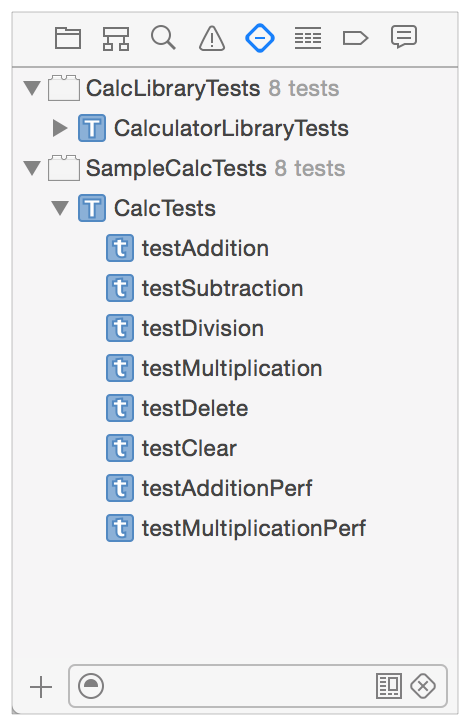
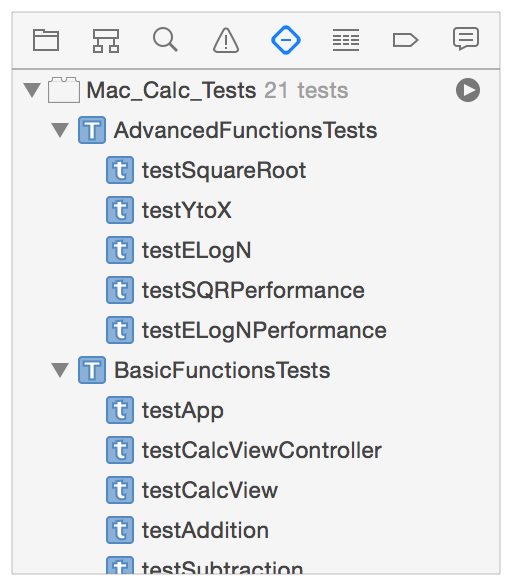

# 使用XCode测试工程代码（一）

在目前自己的开发经验中，发现利用`XCode` 的测试框架`XCTest.framework`来写单元测试和UI测试的工程很少。初级程序员更不会对自己的代码进行单元测试。

在`XCode`进行不同案例的测试并不是一件复杂的事情。同时打开`XCode`的`code coverage`选项，还能够清楚看到那些测试代码的覆盖率。

对于已有项目去添加测试难度大于在编程过程中就一直有持续的测试和集成。这个道理是容易理解的，因为测试需要代码本身的功能模块性强、耦合度低。如果代码从来没有过单元测试和UI测试，很可能这些要求就达不到。那在这个现有状态下，就需要去剥离、重构独立的模块和功能逻辑出来进行测试。所以，难度和工作量自然就高。

## 如何使用XCode测试模块

在我们开始新建一个项目的时候，`XCode`会自动就该项目名称为我们创建一个名为`项目名称Tests`的`test target`。我们使用快捷键`CMD + 5`（[关于快捷键](../contents/xcode-keyborad-shortcuts.md)）展开测试导航栏`test navigator`来查看该`test target`中包含的`test classes`和`test methods`。

好了，概念已经够多了。

比如[官方文档]()中实例工程名为`SampleCalc`，那被自动创建的`test target`就是如下图中的`SampleCalcTests`。

<div align='center'>

<br />
<br />
</div>

在来看看下面一些概念：

- `test target` 这里`target`的概念就是我们的`build target`，也就是对于同一个项目工程`project`而言，我们可以构建具有不同`build settings`的`targets`。
- `test classes` 一个`test target`会包含不同的`test classes`。那么测试类的划分可以是根据功能复杂度去区分；也可以根据模块功能区分。比如，`SampleCalc`这样一个工程，需要测试的主要逻辑是运算。那可以按照功能模块去划分`AdditionTests`、`SubtractionTests`等的测试类；也可以划分为`BasicArithmeticTests`、`ComplexArithmeticTests`等这些测试类。
- `test methods`一个测试类中可以包括多个测试方法。那么测试方法是`XCode`测试中的最小单元。测试方法必须满足以下几个条件：
	- 以`test`关键字开头；没有返回值；不接受任何参数。比如```- (void)testSomething;```。
	- 使用`XCTest`的断言API来判断测试结果是否符合预期。<br>
	
	示例如下
	```objc
	//测试一个view能否成功创建
	  - (void) testCalcView {
	  	// setup (创建测试所需要的基本数据)
	  	app = [NSApplication sharedApplication];
	  	calcViewController = (CalcViewController*)[NSApplication sharedApplication] delegate].window.rootViewController;
	  	calcView             = calcViewController.view;
		// 测试预期结果
	  	XCTAssertNotNil(calcView, @"Cannot find CalcView instance");
	  	// 如果需要的话，销毁创建的测试资源 
	  }
	```
	如果在写测试方法的过程中需要使用到工程中被测试相关代码方法和属性，直接导入包含该方法或者属性的头文件就好了。

## 测试的执行流程

所有的测试方法都是独立于其他测试方法来运行的。如果我们打开`XCode`为我们创建的测试类的模板的话。会依次看到这些方法：

```objc
- (void)setUp; //创建多个测试方法需要共同访问的资源；
- (void)tearDown; //如果需要的话，销毁setUP方法中创建的资源；
- (void)testExample; //普通测试方法的示例;
- (void)testPerformanceExample; //性能测试的示例；
```

那么在执行一个测试方法`test method`的时候，`XCode`会创建一个该测试类的对象；调用```- (void)setUP```方法，然后运行该测试方法，最后调用```- (void)tearDown```方法。如果这个测试类，本身还实现了其类的```+ (void)setUP```和```+ (void)tearDown```方法的话，会先调用类的```+ (void)setUP```，最后调用```+ (void)tearDown```方法。所以，每一个测试方法之间是不会有任何项目干扰的。

在执行测试的时候，我们有很多种选择。可以只是运行一个单独的测试方法；也可以运行一个`test class`中的所有测试方法；甚至可以执行，一个`test target`中所有`test class`中所有的测试方法。

执行运行操作很简单，只需要将鼠标指向`测试导航栏（test navigator）`中的`test target`、`test class`或者是`test method`，右侧就会出现一个播放按钮。点击该按钮，就开始运行测试了。

<div align='center'>

<br />
<br />
</div>

在测试代码源文件中同样可以执行测试。每一个测试方法和`test class`的`@implementation`关键字左边都带有一个钻石形状的符号。将鼠标移至该符号的地方就会出现同样的播放按钮。点击就能执行测试。

## 测试键盘快捷键

在构建一个App的时候，我们会使用`CMD + r`来节约使用鼠标的时间。在测试这个模块上，`XCode`也自带了一些快捷键（[关于快捷键](../contents/xcode-keyborad-shortcuts.md)）。

- `CTR + OPT + CMD + u` 这个快捷键组合比较智能。如果光标的插入点是在一个`test method`中，使用这个快捷键，那么就会只执行这个测试方法。如果是在测试方法之外，在`test class`的其他位置，那么就会执行整个测试类的所有测试方法。
- `CTR + OPT + CMD + g` 这个快捷键是用来重复上次的测试方法。在修改过某个测试方法逻辑的时候，想重复执行上次的测试方法。就使用该快捷键。
- `CMD + u` 这个快捷键是在测试模块中于`CMD + r`相对应（counterpart）的一个快捷键。它是执行当然的`active scheme`进行测试。

## 参考资料

- [Testing With XCode （官方文档）](https://developer.apple.com/library/content/documentation/DeveloperTools/Conceptual/testing_with_xcode/chapters/01-introduction.html)
- [Obj.io Issue: Testing](https://www.objc.io/issues/15-testing/)
