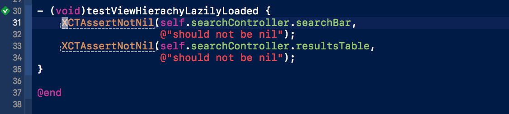
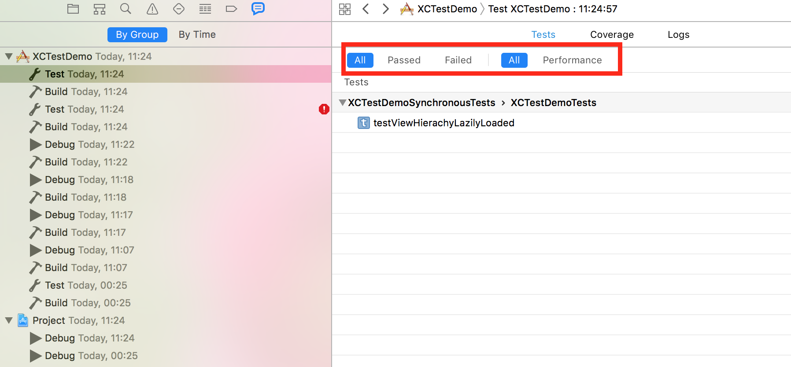
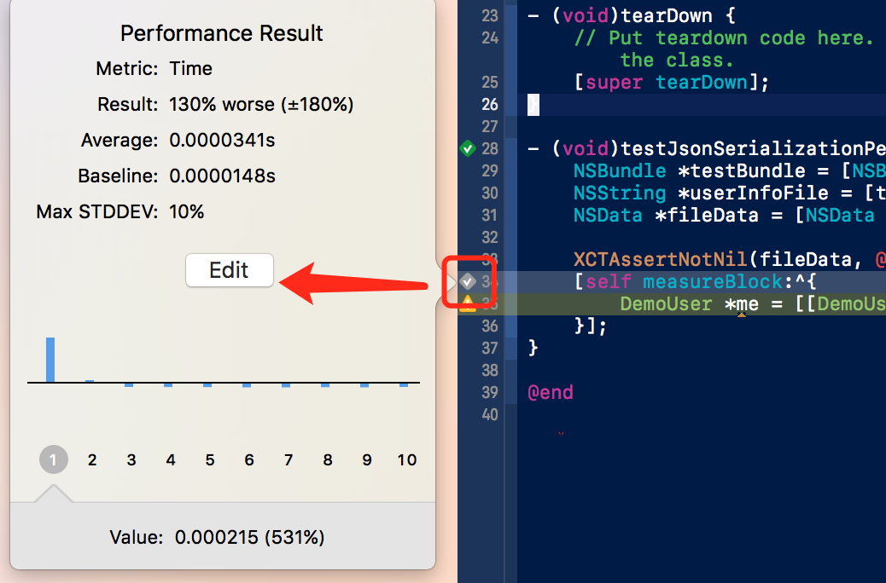

# 使用XCode测试工程代码（二）

在上篇中我们简单介绍[使用XCode对工程代码进行测试的基础知识](../contents/testing-with-xcode-one.md)。

还有许多内容并没有在上篇中提到，为的能够给大家简单地介绍使用`XCode`测试的基本使用和流程。在这一篇中，将基于一个简单的[示例项目](https://github.com/Alex1989Wang/Demos/tree/master/DemoProjects/XCTestDemo)来演示测试过程，同时进一步介绍`XCTest`中的性能测试和对异步功能函数的测试。至于`UITesting`这个内容，准备在[下一篇](contents/testing-with-xcode-three.md)进行介绍。

## 测试示例

在这个[测试示例中](https://github.com/Alex1989Wang/Demos/tree/master/DemoProjects/XCTestDemo)，将重复[上篇](contents/testing-with-xcode-one.md)的一些简单内容。

[上篇](contents/testing-with-xcode-one.md)中，已经介绍了测试方法的写法。在这里就将其运简单地用于实践。

[测试示例](https://github.com/Alex1989Wang/Demos/tree/master/DemoProjects/XCTestDemo)是一个非常简单的工程。使用了[Github 公开的API](https://api.github.com/users)，根据`Github`用户名来查询该用户是否存在。如存在，则显示该用户的信息。

### `XCTest`同步测试特性

[上篇](contents/testing-with-xcode-one.md)中，为了简化测试这个话题，突出测试的流程和基本概念。在测试方法部分，其实只是提到了对于同步执行的功能模块是如何测试的。也就是按照`test method`的写法规则，书写测试方法，使用`XCTest`的断言API来判断测试是否通过。

例如，[测试示例](https://github.com/Alex1989Wang/Demos/tree/master/DemoProjects/XCTestDemo)中的这段判断视图懒加载是否成功的测试代码。

```objc
@interface XCTestDemoSynchronousTests : XCTestCase
@property (nonatomic, strong) DemoSearchViewController *searchController;
@end

@implementation XCTestDemoSynchronousTests

- (void)setUp {
     [super setUp];
     // Put setup code here. This method is called before the invocation of each test method in the class.
     self.searchController = [[DemoSearchViewController alloc] init];
}

- (void)tearDown {
     // Put teardown code here. This method is called after the invocation of each test method in the class.
     [super tearDown];
}

- (void)testViewHierachyLazilyLoaded {
     XCTAssertNotNil(self.searchController.searchBar,
     @"should not be nil");
     XCTAssertNotNil(self.searchController.resultsTable,
     @"should not be nil");
}

@end
```
方法```- (void)setUP```和```- (void)tearDown```在[上篇](contents/testing-with-xcode-one.md)中提到过，是用来创建测试多个测试方法需要的共同资源和销毁这些共同资源。可以按需使用。

实际上，对于上面的该测试。完全可以不适用这两个方法。而将`searchController`的创建放在测试方法中。如：

```objc
- (void)testViewHierachyLazilyLoaded {
     DemoSearchViewController *searchController = [[DemoSearchViewController alloc] init];
     XCTAssertNotNil(searchController.searchBar,
     @"should not be nil");
     XCTAssertNotNil(searchController.resultsTable,
     @"should not be nil");
}
```
`XCTest`框架本身准备了很多断言方法，这些断言方法可以在`XCTestAssertions.h`中找到。

写好测试之后，只需要运行测试就能看到测试结果（关于运行测试的键盘快捷键，已经在[上篇](contents/testing-with-xcode-one.md)中总结过了）。测试本身是一个确定性的`deterministic`，那么测试结果只有通过和失败两种，如下图。当然使用快捷键`CMD + 5`打开测试导航栏，也能看到测试方法的测试结果。

<div align='center'>

</div>

除此之外，使用`CMD + 8`进入`report navigator`也能够看到某一次测试运行的全部信息。还能够根据一定的条件过滤测试方法。

<div align='center'>

</div>

### `XCTest`异步测试特性

由于工程中，一般都会有很多异步逻辑。所以，对于主要的异步逻辑的测试也是必不可少的。`XCTest`中提供了对了异步逻辑的测试。异步逻辑测试方法的执行和同步逻辑测试方法的执行没有太多的区别。

主要区别在于，对于异步逻辑的测试，需要等待异步逻辑完成之后，再对该异步的结果进行相应的测试。同时，对该异步过程，需要设置一个超时值，超过超时值还没有能够得到测试结果会被认为测试失败。

例如对`DemoSearchManager`的异步API的测试代码片段：
```objc
- (void)testAsynchronousSearch {
	XCTestExpectation *expectation =
	[self expectationWithDescription:@"XCTestDemo.asynchronousSearch"];

	NSString *myName = @"Alex1989Wang"; //my github user account
	//This test doesn't take networking reachability into account.
	[[DemoSearchManager sharedManager] getUserInfoWithUserName:myName
	completed:^(NSData *userInfoData) {
		XCTAssertNotNil(userInfoData, @"my account definitely exists.");
		[expectation fulfill];
	}];

	//wait for expection for 2 seconds
	[self waitForExpectationsWithTimeout:2.0 handler:nil]; 
}
```
方法```- (void)getUserInfoWithUserName:completed:```是通过一个传入的`userName`来发送网络请求查询`Github`上是否存在这个注册用户。其源代码在`DemoSearchManager`中。这里只是为了展示异步功能测试的基本做法，并没有完全考虑测试的科学性。比如，这里就没有考虑网络不可用时，对该测试的影响。

在上篇中，已经介绍过一个`test case`的执行原理：在执行某个测试方法时，是首先实例化一个该方法所属的`test class`的实例，然后依次调用相关方法进行测试。那么，如果了解测试方法执行流程，就能够理解上面的异步测试原理。

异步测试需要在`XCTestExpectation`参与进来。一个`XCTestExpectation`的实例描述了一个测试需要达到的期望。使用`XCTestCase`提供的实例方法```- (XCTestExpectation *)expectationWithDescription:```，在进行异步测试之前设定一个或者***多个***需要测试满足的期望。因为，前面刚提到每个测试方法都会单独实例化一个`tese class`的实例来执行；所以不同担心，不同的测试方法之前会相互等待不同的`XCTestExpectation`。

在异步测试过程中，还需要注意的是一定要设置`expectation`的超时值。当测试代码执行到```- (void)waitForExpectationsWithTimeout: handler:```的时候会等待。官方的说法为：

> \- (void)waitForExpectationsWithTimeout:handler: creates a point of synchronization in the flow of a test. Only one -waitForExpectationsWithTimeout:handler: can be active at any given time, but multiple discrete sequences of { expectations -> wait } can be chained together.
>
> \- (void)waitForExpectationsWithTimeout:handler: runs the run loop while handling events until all expectations are fulfilled or the timeout is reached. Clients should not manipulate the run loop while using this API.

所以，其原理就是在利用同步的机制，在超时值或者是该`expectation`达到了之后，`handler`会被调用。测试才完成。

### `XCTest`性能测试特性

性能测试就是将一个`code block`执行10次，收集该次测试的平均时间和标准方差。该次测试获得的这两个值就会和设定的基线值（`baseline value`）进行比较，以此得出测试是通过还是失败。

该基线值是通过测试的需求来设定的。通常情况下，可以以第一次的测试结果值作为之后测试的基线值，或者在此之上进行调整得到基线值。

在[示例工程](https://github.com/Alex1989Wang/Demos/tree/master/DemoProjects/XCTestDemo)中，文件`XCTestDemoPerformanceTest.m`简单地就性能测试进行了示例。该测试的主要内容是对网络数据的序列化过程做了性能测试。

```objc
- (void)testJsonSerializationPerformance {
     NSBundle *testBundle = [NSBundle bundleForClass:[self class]];
     NSString *userInfoFile = [testBundle pathForResource:@"Alex1989Wang" ofType:@".plist"];
     NSData *fileData = [NSData dataWithContentsOfFile:userInfoFile];

     XCTAssertNotNil(fileData, @"should not be nil");
     [self measureBlock:^{
     	DemoUser *me = [[DemoUser alloc] initWithUserInfoData:fileData];
     }];
}
```
为了排除网络数据请求对该测试的干扰，在测试bundle中添加了一个本地`plist`数据文件。该文件的主要作用就是提供一套共测试的本地数据。需要在性能上测试的关键代码（`critical selection`）实际上是写在```measureBlock:```中的代码。其作用是将网络请求会的数据（***测试用的是本地模拟***）先序列化然后转化为模型对象。

在首次运行测试时，并不具备性能测试的`baseline value`，按照[官方文档](https://developer.apple.com/library/content/documentation/DeveloperTools/Conceptual/testing_with_xcode/chapters/01-introduction.html)的说法：

> Performance measuring tests always report failure on the first run and until a baseline value is set on a particular device configuration.

也就是在第一次进行性能测试时，获得的结果都是失败。同时每一个基线值都是跟一个特定的设备配置绑定的。这个很好理解，因为每代产品的硬件性能都不一样，所以当然性能测试的基线值需要设置不同；也就是，对于硬件性能高的设备来讲，可以将基线值设置的更加严苛。

<div align='center'>

</div>

点击该性能测试方法左边侧栏就能够弹出设置测试参考基线值弹窗。设置基线值的过程比较简单。

[WWDC 2014 - Testing in XCode 6](https://developer.apple.com/videos/play/wwdc2014/414/) 中对于性能测试通过还是失败的判断标准有较详细的解读。

- 在设定`baseline value`的条件下，如果该次测试平均用时大于10%的基线值，那么就认为测试未通过。需要注意的是，如果该次测试的平均用时是小于0.1s的，就会直接被忽略，也就是测试无条件通过。
- 如果该次测试的十次测试值的标准方差大于10%（此10%的标准可以调整），那么测试就未通过。


## 参考资料

- [Testing With XCode （官方文档）](https://developer.apple.com/library/content/documentation/DeveloperTools/Conceptual/testing_with_xcode/chapters/01-introduction.html)
- [Obj.io Issue: Testing](https://www.objc.io/issues/15-testing/)
- [WWDC 2014 - Testing in XCode 6](https://developer.apple.com/videos/play/wwdc2014/414/)
