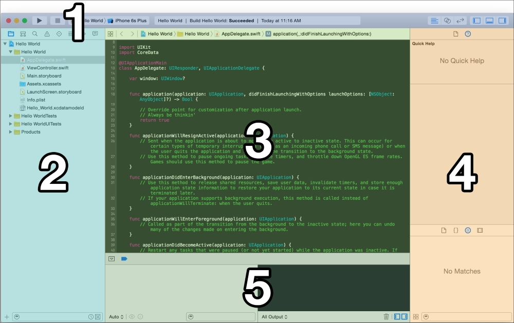
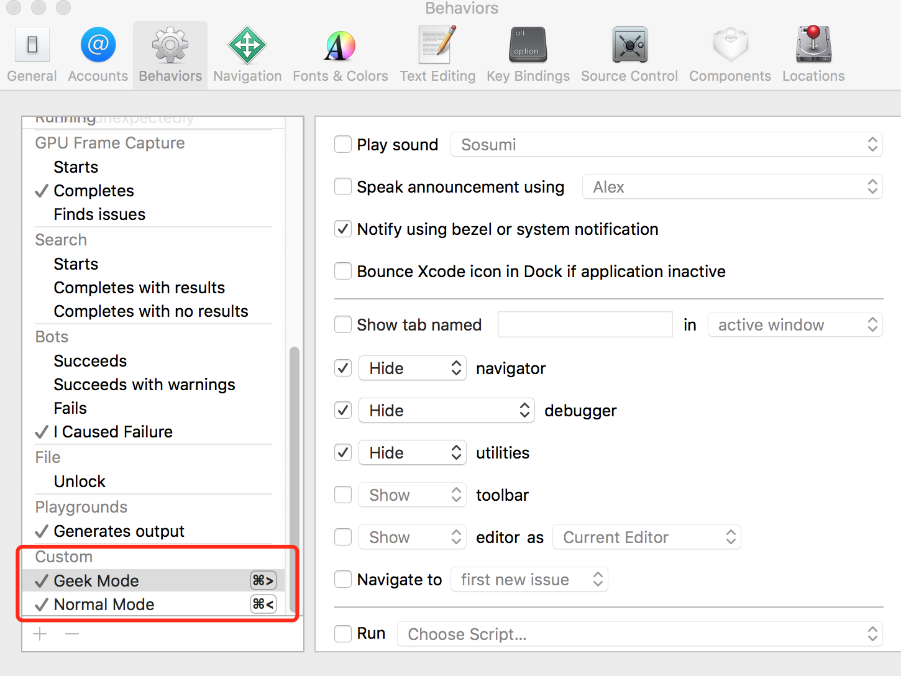

# XCode常用快捷键

在使用XCode过程中，对于源文件浏览，很多初学者会使用鼠标去依次打开项目工程的各级文件夹去寻找，或者使用XCode`源文件导航区`中的搜索功能进行定位。实际上，XCode在代码源文件浏览功能上，实际上内嵌了一些很方便的快捷键。这篇博文主要介绍自己在使用过程中用到的快捷键组合，都是从实际和好用出发；最终，能够大大提高开发效率。

需要说明的是，文中提到的所有快捷键都是默认快捷键。 
- `CMD`：为COMMAND键
- `OPT`：为OPTION键
- `Shift`：为SHIFT键
- `CTR`：为CONTROL键
- `UP`：为向上方向键
- `DOWN`：为向下方向键

## 新建和打开

新建项目和打开文档有几个常用的快捷键。
- `Shift + CMD + n`为新建一个项目
- `CMD + n`为新建一个源文件
- `CMD + o`为打开一个文件（不常用，除了误触）
- `Shift + CMD + o`[为快速打开（模糊搜索）](#文件浏览)

## XCode编辑区域划分
首先来了解XCode的不同区域。通常情况下，我们在使用XCode的过程中，它都是如下图那样的。

 

顶部为XCode的工具栏`Tool Bar`，这个跟其他软件都类似。 
正中间部分为`Editing Area`：也就是我们对源代码编辑的区域。 
最左边部分项目文件导航区`File Navigation Area`：主要展示的是项目文件的目录结构。它展开和关闭的快捷键为：`CMD + 0` 
中间部分的正下方黑色区域为`Debug Area`：也就是调试区域。对调试区展开和关闭的快捷键为：`Shift + CMD + Y`。 
最右边部分为`Utility Area`：功能功用区。也就是根据编辑区域`Editing Area`选中内容不同，出现不同的功能（`Utility`）；其展开和关闭的快捷键为：`OPT + CMD + 0`。

既然这里有不少`CMD + 0`的组合，很有好奇心的你不如试试所有`CMD + 数字`都是什么快捷键吧。

## 文件浏览

文件浏览这个部分有三个常用的快捷键组合：
- `CMD + Shift + O` ***模糊查找***
- `CMD + Shift + J` ***展开该文件所在的项目目录，同时在文件导航区选中该文件***
- `CMD + J` ***XCode从聚焦文件导航区状态，变回聚焦源文件编辑区状态，源文件进入编辑状态***
- `CTR + CMD + UP` ***在头文件和.m文件之间切换***

如何将这些快捷键组合起来使用呢？假设说，现在你在一个名为`ViewController.m`的文件中正在编辑；而你想要跳转到`AppDelegate.m`去编辑。
- 按住`CMD + Shift + O`，输入`AppDelegate`或者`adelegate`（记住这是模糊搜索）；你会发现一个一般就是`AppDelegate.m`这个文件。如果没有找到，你可以使用`UP`或者`DOWN`上下翻页查找。选中之后按下`Enter`键编辑区就会显示该文件内容。
- 如果这个时候，你想查看该文件在项目目录中的位置，就可以按下`CMD + Shift + J`。就会选中项目导航区域中的该文件，同时依次展开其所在的目录、父目录... 
- 使用`CMD + J`便会回到源文件编辑区域，继续编辑。在编辑区域可以使用XCode本身一些行首、行尾跳转的一些快捷键。比如：`CTR + n`、`CTR + p`、`CTR + w`和`CTR + b`等。我觉得他们灵活性并不高，所以在使用过一段时间之后，就换成了XCode的`Vim`插件：`XVim`。十分推荐。
- 使用`CTR + CMD + UP`可以在头文件和.m文件之间进行切换。方便查阅头文件中的内容。

## 定义查阅

在一个头文件或者.m文件中如何快速地定位到某个方法或者`property`呢？
- `CTR + 6` ***搜索文件中定义的`property`和方法***

按下`CTR + 6`后，编辑区右上方会出现一个下拉列表。为该文件中所有定义的`property`和方法名。继而，可以输入某些关键字进行搜索（搜索功能不是很强大）。然后按下`UP`或者`Down`进行选中。文件就会聚焦到选中的方法区域。

在一个文件中，想要查阅使用到的其他文件中的方法或者`property`怎么办？
- `CTR + CMD + J` ***跳转到其他文件中定义的方法实现或者`property`***
- `CTR + CMD + LEFT` ***回到上一级***

当然，如果你使用的是`XVim`，那么还有其他的快捷键可以选择。在使用这个快捷键组合的时候，一定要注意自己的光标是在该方法或者`property`上。在查阅完成之后，你可以按下`CTR + CMD + LEFT`回到刚才的地方。

## 自定义行为

我个人比较喜欢在编辑代码的时候没有干扰。所以自定义了一个`Geek Mode`，其快捷键触发为`CMD + >`。在该状态下，会将除了`Tool Bar`和`Editing Area`区域外的所有区域全部隐藏起来。当然，为了回到通常的状态，还定义了一个`Normal Mode`，其快捷键为`CMD + <`。在该状态下会恢复所有的隐藏区域。

 

自定义快捷键行为在XCode的`Preference`设置中，按下`CMD + ,`就可以触发偏好设置。如上图所示，在`Behaviors`一栏添加你想要的自定义XCode行为就好了。

## 如果你喜欢Vim

我自己在使用XCode的过程中是使用了[XVim](https://github.com/XVimProject/XVim)插件的。在代码编辑的速度上面有了很大提升。以至于在后来很多场合下能够用`Vim`的地方就离不开它。`Vim`有很多插件，在写这篇`Markdown`文档的时候也用了`Vim`进行的编辑。 
关于`Vim`的学习资料很多，自带的`Vim tutor`就是一个很好入手的地方。台湾前辈Edward Lee写过一个很好的教程：[大家来学Vim](http://www.study-area.org/tips/vim/)。 
关键在于每天的积累，慢慢就很快了。
